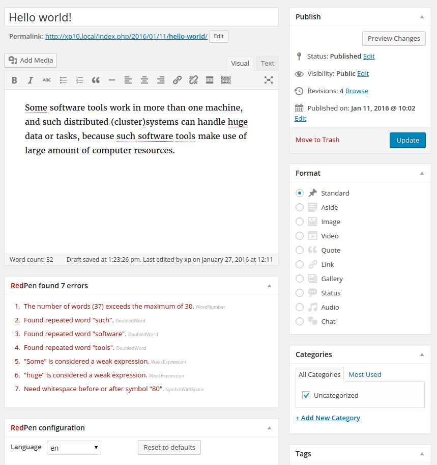

# RedPen WordPress plugin

## About

This plugin integrates [RedPen](http://redpen.cc) text validation into the WordPress editor.

### Features

* Validates text with RedPen as you type
* Supports both Visual and Text WordPress editors
* Validation errors are marked in Visual editor in-place
* Validation error messages are also listed below and highlighted in the editor on click
* Autodetection of supported languages and variants (currently, English or Japanese)
* RedPen [validators](http://redpen.cc/docs/latest/index.html#validator) and [symbols](http://redpen.cc/docs/latest/index.html#setting-symbols) can be configured directly in WordPress panel below the editor
* Configuration is stored for next visit with the same browser

### Screenshot



## Prerequisites

To use the plugin, you need to have **RedPen Server** v1.4.3 or newer running on the same machine.
Please refer to [RedPen Server documentation](http://redpen.cc/docs/latest/index.html#server) for more details.

## Installation

Before installing make sure that both **WordPress** and **RedPen Server** are up and running properly.

* [Download](https://github.com/redpen-cc/redpen-wordpress-plugin/archive/master.zip) and extract plugin to *wordpress/wp-content/plugins*.
* Make sure the correct RedPen server URL is defined in *config.php*. By default it is http://localhost:8080.
* Install PHP cURL library if you don't already have it, e.g. on Ubuntu
    ```sudo apt-get install php5-curl```
* Activate the plugin in WordPress Admin console -> Plugins -> Installed plugins.

## For developers [](https://travis-ci.org/redpen-cc/redpen-wordpress-plugin)

### Running the tests

* Install all required dependencies using npm (Karma, Jasmine, PHPUnit):

    ```npm install```

* All unit tests (JavaScript and PHP) can then be run with

    ```npm test```
    
JavaScript tests will be run in PhantomJS by default. You can change the browser in *tests-js/karma.conf.js*.

### Configuring IntelliJ IDEA

To make development easier, preconfigured IntelliJ IDEA or PHPStorm project files are already in this repository.

Install the following plugins:

* PHP (if using IDEA)
* Karma

Run configurations are also provided for running of unit tests.
